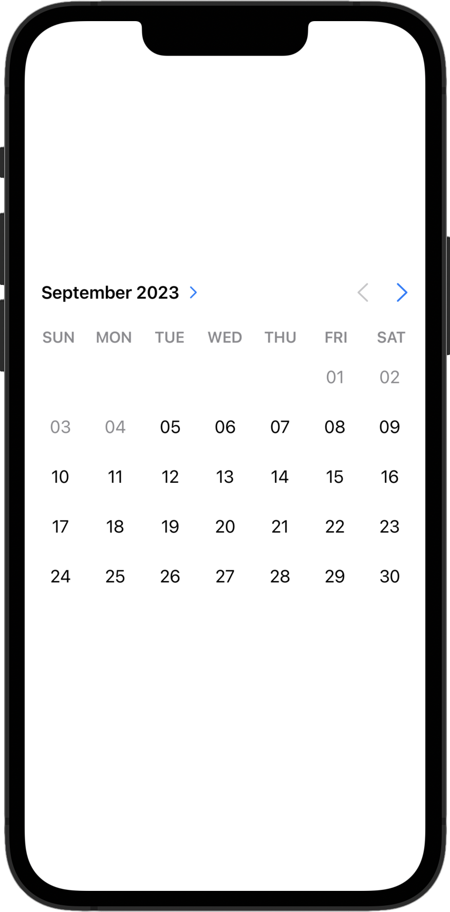

# DateRangePicker
DateRangePicker is a SwiftUI view that allows users to select a range of dates from a calendar in a given interval.



## Installation
DateRangePicker is available through [Swift Package Manager](https://swift.org/package-manager).

```swift
.package(url: "https://github.com/MrAsterisco/DateRangePicker", from: "<see GitHub releases>")
```

### Latest Release
To find out the latest version, look at the Releases tab of this repository.

## Usage
DateRangePicker can display a calendar with a range of dates selected. It can be used in a form, or as a standalone view.

```swift
DateRangePicker(
  month: $month, // A binding to control and read the currently visible month.
  year: $year, // A binding to control and read the currently visible year.
  selection: $range, // The range of dates selected.
  minimumDate: <any date>, // The minimum date that can be selected (optional).
  maximumDate: <any date> // The maximum date that can be selected (optional).
)
```
The DateRangePicker selection is represented by an `OpenDateInterval` struct, which is a freely-inspared version of a `DateInterval` that allows for open-ended intervals (aka. intervals that do not have an end date).

## Compatibility
ComboPicker requires **iOS 15.0 or later**.

While compatibility with other platforms is planned, there is no guarantee on when that will be. Each platform handles date pickers differently and requires a different implementation. You are welcome to contribute to this project by adding support for other platforms!

## Contributions
All contributions to expand the library are welcome. Fork the repo, make the changes you want, and open a Pull Request.

If you make changes to the codebase, I am not enforcing a coding style, but I may ask you to make changes based on how the rest of the library is made.

## Status
This library is under **active development**. Even if most of the APIs are pretty straightforward, **they may change in the future**; but you don't have to worry about that, because releases will follow [Semantic Versioning 2.0.0](https://semver.org/).

## License
DateRangePicker is distributed under the MIT license. [See LICENSE](https://github.com/MrAsterisco/DateRangePicker/blob/main/LICENSE) for details.